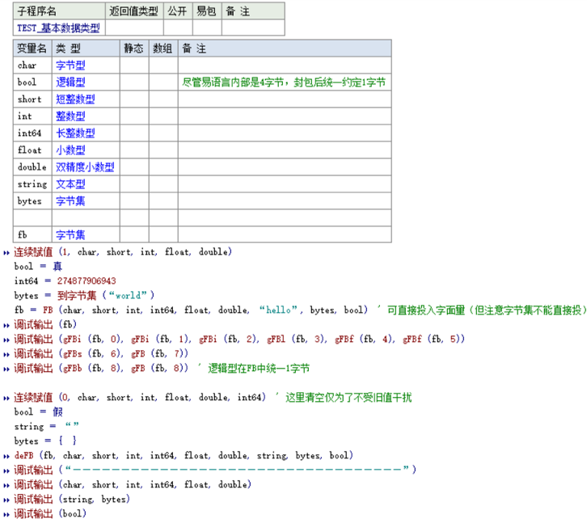

# 白菜全语言数据类型封包与解包标准

### 简介

仓库目前提供了易语言和PHP实现作为参考示例，旨在提供一套简单高效、跨语言的数据封包（FB）与解包（deFB）方案，便于在对数据进行统一的二进制参数级交互（封包中无需存档额外元信息）

- 支持基本数据类型（singned/unsigned char/short/int/int64,bool,float/double）
- 支持字符串,字节集（String,Bytes）
- 支持数组（包含以上基本类型，及其下面结构体数组）
- 支持结构体（对象序列化/反序列化，嵌套结构体/结构体数组）


### 设计标准参考

> https://wiki.xbcsoft.com/BC-FB-Standard/


#### 快速示例（PHP）

```php
<?php
include 'FB.php';

// 准备数据
$a = 123;           //int
$b = 'hello';       //string

// 生成封包（FB 将把字段编码为二进制格式）
$fb = FB(i16($a), $b);
// 输出封包的可读形式（解字节集十进制视图）
echo "FB bytes: " . jzjj($fb) . "\n";

// 解包示例（将封包还原到所有变量，需提前给定反射类型—脚本语言这里可用特定初值表示）
$out_a = T_short;
$out_b = T_String;
deFB($fb, $out_a, $out_b);

echo "解包结果：a={$out_a}, b={$out_b}\n";

// 解包示例（对按索引读取）
$first = gFB($fb, 0);                        //取第一个参数（按字节集）
echo "参数1（原始）：" .jzjj($first). "\n";
$first_int = gFBi($fb, 0);                   //取第一个参数（按整数）
echo "参数1（整型）：" .$first_int. "\n";
$second = gFB($fb, 1);                       //取第二个参数
echo "参数2：" .$second. "\n";
```

```
解包结果：a=123, b=hello
参数1（原始）：Bytes:2{123,0}
参数1（整型）：123
参数2：hello
```


#### 快速示例（易语言）



```
* 字节集:82{9,0,0,0,44,0,0,0,45,0,0,0,47,0,0,0,51,0,0,0,59,0,0,0,63,0,0,0,71,0,0,0,76,0,0,0,81,0,0,0,82,0,0,0,1,1,0,1,0,0,0,255,255,255,255,63,0,0,0,0,0,128,63,0,0,0,0,0,0,240,63,104,101,108,108,111,119,111,114,108,100,1}
* 1 | 1 | 1 | 274877906943 | 1.000000 | 1.000000
* “hello” | 字节集:5{119,111,114,108,100}
* 真 | 字节集:1{1}
* “——————————————————————————————————”
* 1 | 1 | 1 | 274877906943 | 1.000000 | 1.000000
* “hello” | 字节集:5{119,111,114,108,100}
* 真
```


#### 数组、结构体更多示例请参考：

> [https://wiki.xbcsoft.com/BC-FB-Standard/?file=3.0_封包数据类型的存储结构.html](https://wiki.xbcsoft.com/BC-FB-Standard/?file=3.0_%E5%B0%81%E5%8C%85%E6%95%B0%E6%8D%AE%E7%B1%BB%E5%9E%8B%E7%9A%84%E5%AD%98%E5%82%A8%E7%BB%93%E6%9E%84.html#array)
>
> [https://wiki.xbcsoft.com/BC-FB-Standard/?file=4.0_结构体对象的封包方案.html](https://wiki.xbcsoft.com/BC-FB-Standard/?file=4.0_%E7%BB%93%E6%9E%84%E4%BD%93%E5%AF%B9%E8%B1%A1%E7%9A%84%E5%B0%81%E5%8C%85%E6%96%B9%E6%A1%88.html)


### QQ交流群

xbcsoft-白易语言：668536886


## 许可证书

本项目的发布受[Apache 2.0 license](https://github.com/PaddlePaddle/PaddleCLS/blob/master/LICENSE)许可认证。